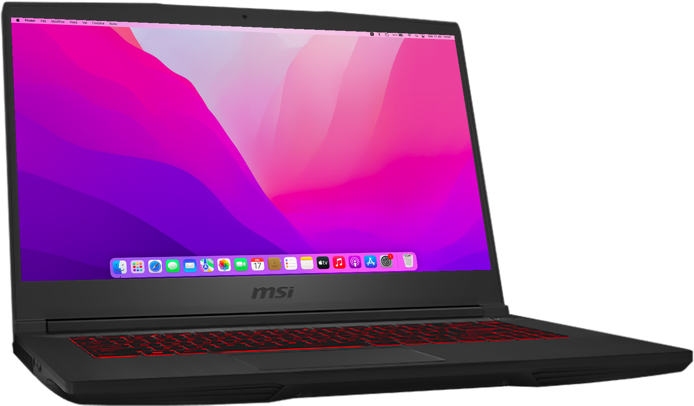

# MSI GF65 Thin 10UE Hackintosh OpenCore

### ⚠️ Disclaimer:
- Use this EFI as an example, remember to always make your efi so you know how to fix it in case something breaks...
- This EFI may not be constantly updated to the latest version of opencore especially if no major changes are made
- Please read the whole readme before proceeding
- The readme is not yet complete and the efi is not yet completely clean
##

### 💻 My Hardware
| Component      | Brand/info                                                       |
|----------------|------------------------------------------------------------------|
| **CPU**        | `Intel Core i7-10750H`                                           |
| **RAM**        | `Samsung 2x8 3200mhz M471A1K43DB1-CWE`                           |
| **Storage 1**  | `Micron_2210_MTFDHBA512QFD 512GB` (for MacOS, the original ssd)  |
| **Storage 2**  | `WD Blue SN570` (for Windows)                                    |
| **iGPU**       | `Intel UHD Graphics 630`                                         |
| **dGPU**       | `Nvidia RTX 3060m (disabled)`                                    |
| **Audio**      | `ALC235 - layout 29`                                             |
| **Ethernet**   | `Realtek Gigabit Ethernet`                                       |
| **Battery**    | `4500 mAh`                                                       |
| **Trackpad**   | `Synaptics`                                                      |
| **WiFi card**  | `Intel Wi-Fi 6 AX201`                                            |
| *Replacement WiFi card*  | `Broadcom BCM94360NG`                                  |

### ✅️ What works</strong>

- iGPU acceleration Intel UHD 630 2048 MB
- Sleep
- Power management
- Audio (speaker, microfone, headphone jack)
- Battery percentage
- USB ports
- Display Brightness
- Wifi & Bluetooth
- iMessage
- Dual Boot with windows 10 & 11
- Keyboard
- Brightness & volume FN keys
- Trackpad
- Internal camera
- Ethernet port
- Continuity: Handoff & Universal clipboard
- AirPlay: `iPad -> Mac` & `Mac -> TV`
- Sidecar wired
- *Sidecar wireless with broadcom card only

### ❌️ What doesn't work

- RTX 3060m (no drivers)
- Airdrop (can be fixed with a broadcom card, such as BCM94360NG)
- Sidecar Wireless, Universal Control, *[Apple Watch Unlock](https://github.com/ts1/BLEUnlock), *[Instant Hotspot](https://openintelwireless.github.io/itlwm/FAQ.html#limitation-of-airportitlwm-kext) with intel wifi card
- HDMI port (since it's wired to nvidia gpu)
- Widevine DRM in safari (use a chromium-based browser or Firefox instead)
- Fans readings/controls (I'm working on it)

### ⚠️ Not tested
- Video output over USB-C
- Apple Watch Unlock, Universal Control, Instant Hotspot with broadcom card

### ⚠︎ Known issues
- wireless sidecar may lag (tested with BCM94360NG & iPad 6 ios 15.1)

## ⚙️ Setup

<strong>🔧 BIOS Settings</strong>

   
  
**Firstly Unlock hidden BIOS Settings by pressing `right shift + right Ctrl + left alt + F2`**

**Advanced TAB**
- `Power & Performance > CPU-Power Management Control > Configure CPU Lock Options > CFG lock`: must be **Disabled**
- `Intel Virtualization Technology` & `VT-d` both enabled
- `System Agent (SA) Configuration > Graphics Configuration > DVMT Pre-Allocated`: must be **64M**
- `XHCI Hand-off`: must be **Enabled**
- `Intel(R) Speed Shift Technology`: must be **Enabled**

**Boot TAB**
- `Fast Boot`: **Disabled**

**Security TAB**
- `Secure Boot > Secure Boot Support`: must be **Disabled**

<strong>🗒 config.plist edits</strong>

   
  
- ### Default keyboard layout and language:
 *optional:* edit `prev-lang:kbd` in config.plist in order to match your keyboard layout and language (mainly relevant in recovery and installation)
  
  default is (<>) which will force the Language Picker to appear at first boot up.
  More info [here](https://dortania.github.io/OpenCore-Install-Guide/config-laptop.plist/coffee-lake.html#add-4) at the bottom of `7C436110...` etc.
  
  
- ### Generating SMBIOS:

We need a tool, called [GenSMBIOS](https://github.com/corpnewt/GenSMBIOS) from corpnewt, to generate a fake serial number, UUID and MLB for our Hackintosh.

**this step is mandatory to get working iServices, be careful not to make any mistakes**

1. Download GenSMBIOS from the link above as .ZIP, then extract it.
2. Start GenSMBIOS and select option `1` to download and install MacSerial
3. Select option `2` and open the `config.plist` located under `EFI > OC`
4. Select option `3` and enter `MacBookPro16,1`, serials will be generated
5. **IMPORTANT:** reminder that you need an **invalid serial!** to check copy and paste the second part saying `Serial: XXXXX..` in [Apple's Check Coverage Page](https://checkcoverage.apple.com/), if you get a red message saying "We're sorry, we're unable to check coverage for this serial number."
 then, you're good to go! Otherwise, go back and restart from step `2` (more info [here](https://dortania.github.io/OpenCore-Post-Install/universal/iservices.html#serial-number-validity))

- ### Fix iServices

Follow the [iServices OpenCore Guide](https://dortania.github.io/OpenCore-Post-Install/universal/iservices.html#fixing-rom)

## 🛠 Post-install

<strong>Copy EFI to the internal drive</strong>

   

1. Open terminal. Type `sudo diskutil mountdisk disk0s1` (disk0s1 corresponds to the EFI partition of the internal disk)
2. Open Finder and copy the entire EFI folder from your USB to the root disk's EFI partition.
3. Unplug the USB device and reboot your laptop, while rebooting hold down `F11` to access the boot menu.
4. Boot from `Micron_2210_MTFDHBA512QFD` (or your ssd's name).
5. To check that everything has gone well repeat `step 3` and look for a new entry called `OpenCore`
4. Now you can boot macOS without your USB device.  :D

## ⭐️ Extras

Userful Apps (for me)</strong>

   
  
- [Tiles](https://freemacsoft.net/tiles/) *Aero snap experience for MacOS*
- [Stats](https://github.com/exelban/stats) *a good free alternative to iStat Menus*
- [Mos](https://mos.caldis.me) *"A lightweight tool used to smooth scrolling and set scroll direction independently for your mouse on MacOS"*
  
  

  
## not completed yet...
